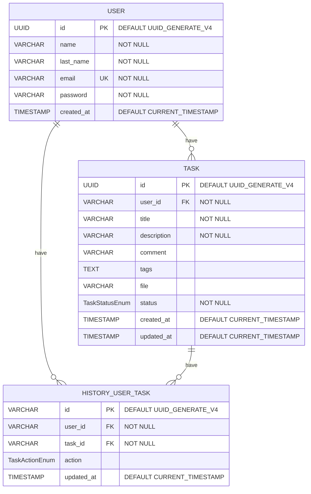

# ToDo Backend

_RESTful API - Task Management System_

## Objective ⌨️

A REST API for a task management system must be created. Through this system a user will be able to view, add, edit or delete his personal tasks. Each task must have an associated status, which can be "pending", "in progress" or "completed". In addition, the paths to access the tasks must be protected, and only authenticated users should be able to access them.

## Beginning 🚀

### Database diagram 💾



### Prerequisites 📋
It is necessary to mention that the service needs [environment](.env.example) variables which are very necessary for the operation of the service.

For the database, we chose to use a local database by means of [docker compose](docker-compose.yml)

To lift the containers simply use the following command in the root folder

```shell
docker compose up -d
```

### Installation 🔧
To install the dependencies of the service simply use the following command
```shell
npm install
```

### Running 🆙
Depending on the environment, it is recommended to initialize the project.

- Dev
    ```shell
    npm run start:dev
    ```
- Prod
    ```shell
    npm run start:prod
    ```
## Documentation 📄
- Swagger
  In code it was decided to document with swagger, the path of the documentation is as follows
  ```route
  http://localhost:3000/docs
  ```


- Postman
  Since the endpoints can send files and various complex parameters, it was also decided to make a documentation in Postman, in order to make the requests more easily.
  [Here](https://www.postman.com/BetoNajera9/workspace/todo) is the link to the collection

## Built with 🛠️

- [Nestjs](https://nestjs.com/) - The framework used
- [npm](https://www.npmjs.com/) - Dependency handler
- [PostgreSQL](https://www.postgresql.org/) - Database
- [Typescript](https://www.typescriptlang.org/) - Language

## Author ✒️

- **Roberto Miron Najera** - _Initial Work_ - [betonajera9](https://github.com/villanuevand)

## License 📄

This project is under the (MIT) License - see the [LICENSE](LICENSE) file for details.

---

⌨️ with ❤️ by [betonajera](https://github.com/BetoNajera9) 😊
