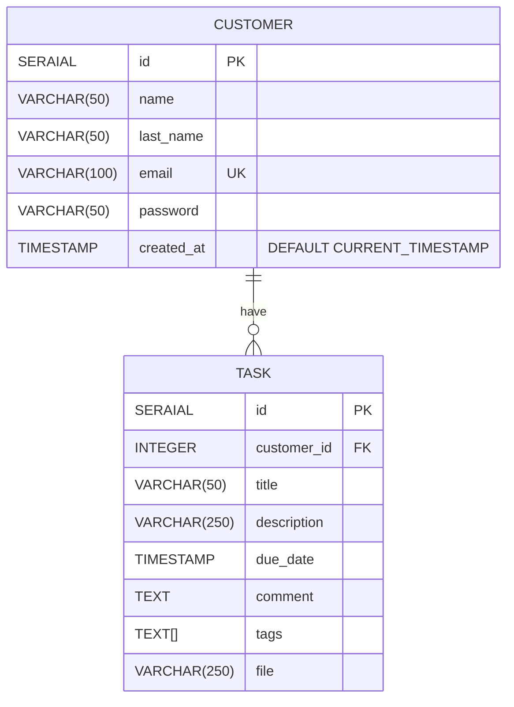

# ToDo Backend

_RESTful API - Task Management System_

## Objective ⌨️

A REST API for a task management system must be created. Through this system a user will be able to view, add, edit or delete his personal tasks. Each task must have an associated status, which can be "pending", "in progress" or "completed". In addition, the paths to access the tasks must be protected, and only authenticated users should be able to access them.

## Beginning 🚀

### Database diagram 💾

### Prerequisites 📋

### Installation 🔧

### Running 🆙

## Despliegue 📦

## Built with 🛠️

- [Nestjs](https://nestjs.com/) - The framework used
- [npm](https://www.npmjs.com/) - Dependency handler
- [PostgreSQL](https://www.postgresql.org/) - Database
- [Typescript](https://www.typescriptlang.org/) - Language

## Author ✒️

- **Roberto Miron Najera** - _Initial Work_ - [betonajera9](https://github.com/villanuevand)

## License 📄

This project is under the (MIT) License - see the [LICENSE](LICENSE) file for details.

---

⌨️ with ❤️ by [betonajera](https://github.com/BetoNajera9) 😊
